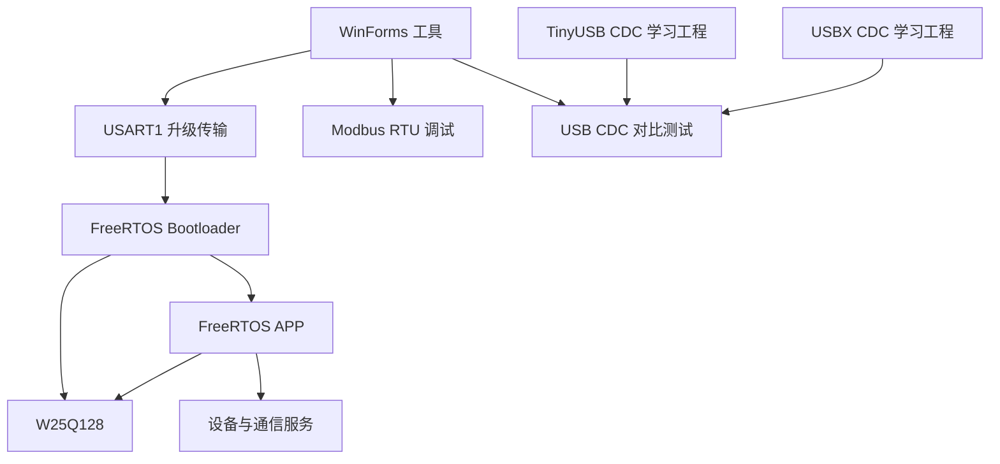
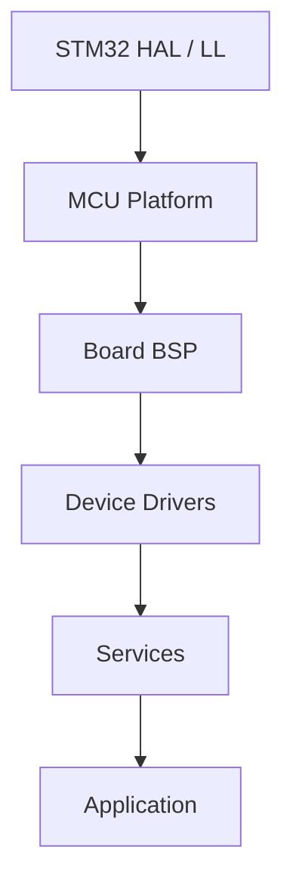

# 系统架构

## 1. 目标与边界

平台面向同一 STM32F407 MCU 平台下的多种底板和产品型号。当前核心板是第一个 BSP，不把板级引脚、DMA 或外设实例写死在公共驱动和业务模块中。

首版优先形成可运行、可测试的最小闭环，不同时实现全部远程接口。



## 2. 仓库规划

```text
firmware/
  bootloader/                 独立 CubeMX/FreeRTOS/CMake 工程
  app/                        独立 CubeMX/FreeRTOS/CMake 工程
platform/
  stm32f4/                    MCU 时钟、中断、HAL/LL 适配
boards/
  atk_f407_core_v1_4/         当前核心板 BSP 和设备清单
components/
  osal/                       FreeRTOS 抽象
  drivers/                    W25Q128、24C02 等设备驱动
  storage/                    块设备、分区、事务记录
  update/                     镜像、协议、安装和回滚
  crypto/                     哈希、签名验证和密钥接口
  protocol/                   字节流和升级传输协议
  modbus/                     RTU/TCP、寄存器映射和服务适配
  logging/                    结构化事件与崩溃记录
  health/                     任务心跳、看门狗和启动确认
examples/
  usb_tinyusb_freertos/       独立 TinyUSB CDC 学习工程
  usb_usbx_freertos/          独立 USBX CDC 学习工程
pc/
  DeviceTool.sln              WinForms 工具及类库
tools/
  packaging/                  固件打包和开发签名工具
  provisioning/               后续生产注入工具
tests/
  host/                       PC 单元测试
  hil/                        硬件在环和断电测试
```

Bootloader 和 APP 各自拥有 `.ioc`、`FreeRTOSConfig.h`、启动文件、链接脚本和 CMake 入口。公共组件以库方式引用，禁止复制源码形成分叉版本。

## 3. 软件分层



### 3.1 MCU Platform

- 封装 GPIO、UART、SPI、I2C、CAN、SDIO、USB、Flash、时间和中断能力。
- CubeMX 生成句柄只能在 Platform/BSP 边界出现。
- 向上层暴露显式上下文对象，不暴露 `huart1`、`hspi1` 等全局变量。

### 3.2 Board BSP

- 描述引脚、外设实例、DMA、IRQ 优先级和板载设备。
- 静态创建驱动实例并注入依赖。
- 不包含产品业务逻辑。
- 不在公共模块中堆积 `#ifdef BOARD_xxx`；不同底板使用不同装配文件。

### 3.3 Device Driver

- 驱动不自行创建任务。
- 驱动不动态分配内存。
- 总线、GPIO 和时间服务通过接口传入。
- 算法和协议核心应可在 PC 上单元测试。

### 3.4 Service

- 任务属于服务，不属于普通驱动。
- 一个外设或总线只有一个明确所有者。
- 任务间使用有界队列、通知和事件；禁止共享可变全局状态。
- ISR 只搬运最少数据、清除标志并通知任务。

## 4. FreeRTOS 任务规划

### 4.1 Bootloader

| 任务 | 职责 |
|---|---|
| `HealthMonitorTask` | 任务心跳、栈水位、复位原因和看门狗 |
| `UpdateManagerTask` | 升级状态机、版本策略、确认与回滚 |
| `TransportTask` | USART1；后续适配 USB、CAN 等入口 |
| `StorageTask` | 独占 W25Q128 和内部 Flash 写操作 |

Bootloader 使用静态任务、静态队列和静态缓冲区；禁止运行期创建/删除对象。

### 4.2 APP

| 任务 | 职责 |
|---|---|
| `SystemManagerTask` | 系统状态和启动编排 |
| `HealthMonitorTask` | 健康检查、看门狗与升级确认 |
| `CommunicationTask` | Modbus 及后续通信服务 |
| `UpdateAgentTask` | 远程下载、Candidate 写入与重启申请 |
| `StorageTask` | 外部存储和参数请求串行化 |
| `DeviceServiceTask` | 设备采集和控制业务 |

APP 启动完成后禁止使用通用 `malloc/free`。网络等确需动态负载的模块使用固定块内存池。

## 5. PC 工具

```text
DeviceTool.WinForms       界面和用户交互
DeviceTool.Core           设备模型、错误码和公共状态
DeviceTool.Transport      Serial/USB CDC 连接
DeviceTool.Update         升级协议、进度和恢复
DeviceTool.Modbus         Modbus Client 和寄存器模型
DeviceTool.Tests          协议与模块测试
```

生产私钥不能进入 WinForms。WinForms 只选择和传输已经签名的固件包；生产签名属于隔离的发布流程。

## 6. USB 学习分支

两个工程实现相同的 CDC ACM 功能和测试负载：

- 枚举与断开重连；
- 回显与大块收发；
- Flash/RAM/任务栈统计；
- 吞吐率和 CPU 占用；
- 异常拔插、复位和连续压力测试。

TinyUSB 工程使用其 FreeRTOS OSAL；USBX 工程使用 Standalone 模式，由 FreeRTOS 服务任务驱动。两个工程不共享 USB 栈适配代码，也不在同一固件中切换。

## 7. Modbus

公共组件预留 Client 和 Server：

```text
modbus_core
modbus_rtu_transport
modbus_tcp_transport
modbus_register_map
modbus_service
```

首个练习使用 USART1 + CH340 实现 RTU Server。Modbus 回调只访问寄存器适配层或发送服务请求，不直接修改业务全局变量。正式引入第三方库时固定具体 tag/commit，禁止依赖浮动的 `master`。

