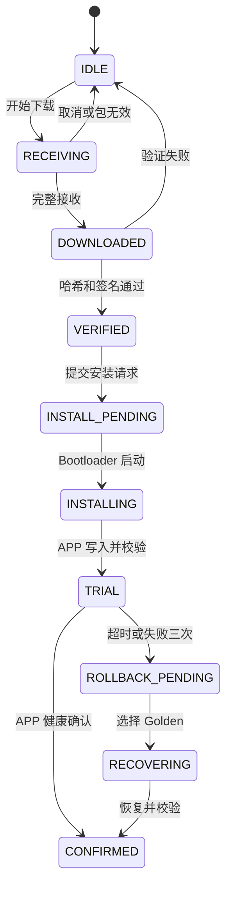

# 存储与升级设计

## 1. 内部 Flash 分区

STM32F407ZGT6 的 1 MB 内部 Flash 按硬件扇区边界分为：

| 区域 | 扇区 | 起始地址 | 结束地址 | 大小 |
|---|---|---:|---:|---:|
| Bootloader | 0..5 | `0x08000000` | `0x0803FFFF` | 256 KB |
| APP | 6..11 | `0x08040000` | `0x080FFFFF` | 768 KB |

约束：

- APP 链接地址和 VTOR 均为 `0x08040000`。
- Bootloader 的所有内部 Flash 写 API 必须校验目标范围。
- APP 不能链接或写入 Bootloader 区域。
- 量产时对 Bootloader 扇区启用写保护。
- Bootloader 代码尺寸、静态 RAM 和任务栈设置发布预算门槛。

## 2. W25Q128 分区

初始逻辑布局如下，最终以分区表常量为准：

| 分区 | 起始偏移 | 大小 | 用途 |
|---|---:|---:|---|
| Candidate | `0x000000` | 1 MB | 待安装镜像 |
| Golden | `0x100000` | 1 MB | 上一份已确认镜像 |
| Metadata A | `0x200000` | 64 KB | 事务记录副本 A |
| Metadata B | `0x210000` | 64 KB | 事务记录副本 B |
| Event Log | `0x220000` | 512 KB | 升级和运行事件环形日志 |
| Crash Dump | `0x2A0000` | 128 KB | HardFault 和看门狗现场 |
| Reserved | `0x2C0000` | 余量 | 后续扩展 |

每个分区起始地址按 64 KB 擦除块对齐。驱动同时支持 4 KB Sector 擦除，但分区边界不能依赖未对齐的小扇区。

## 3. 镜像容器

第一版容器包括固定头、可扩展 Manifest、完整 APP Payload 和签名：

```text
Header
Manifest
Payload
ECDSA-P256 Signature
```

Manifest 至少包含：

- 格式版本；
- 产品和硬件标识；
- APP 语义版本；
- 单调安全计数器；
- Payload 长度、目标地址和入口地址；
- Build ID；
- SHA-256；
- 签名 Key ID；
- 镜像类型和能力标志。

第一版只接受完整、未压缩、未加密的 APP 镜像。容器保留压缩、差分和加密标志，但未知标志必须安全拒绝，不能静默忽略。

## 4. 升级状态机



只有稳定状态写入持久化记录。每条记录至少包含 Magic、格式版本、Generation、状态、镜像哈希、版本、计数器、失败原因、CRC/MAC 和 Commit 标志。

## 5. 掉电恢复

| 掉电阶段 | 再上电处理 |
|---|---|
| Candidate 下载中 | 继续断点下载或清除未提交包；旧 APP 不受影响 |
| Metadata 更新中 | 选择 Generation 最新且校验正确的副本 |
| APP 擦除中 | Bootloader 重新从 Candidate 安装 |
| APP 写入中 | APP 校验失败，重新安装 |
| TRIAL 运行中 | 增加试启动计数，达到三次后恢复 Golden |
| CONFIRMED 提交中 | 根据双副本记录和镜像校验完成幂等恢复 |

升级过程的任何步骤都必须可重复执行，不能假设某一步只运行一次。

## 6. 确认与防降级

- 默认健康确认窗口为 60 秒。
- 最多允许三次 TRIAL 启动。
- APP 完成 RTOS、W25Q128、关键配置、看门狗和必要通信自检后才能确认。
- 安全计数器只在确认后提交。
- 普通发布签名不能降低安全计数器。
- 同一次 TRIAL 事务可以回滚到先前已确认的 Golden。
- 已确认新版本后的主动降级需要专用恢复签名。
- 紧急降级不降低设备保存的安全高水位。

## 7. USART1 升级协议边界

传输协议与升级核心分离。首版帧至少包含：

```text
Magic | ProtocolVersion | Command | SessionId | Sequence
Offset | PayloadLength | Payload | FrameCRC
```

需要支持：

- 查询设备和 Bootloader 信息；
- 创建升级会话；
- 按偏移写入分块；
- 查询已接收范围；
- 完成下载并请求验证；
- 查询安装进度和错误码；
- 取消会话；
- 复位并进入 APP。

USB、CAN 和网络适配器以后复用镜像和会话语义，不重复实现签名、版本和存储逻辑。

## 8. 安全边界

- 设备只保存普通发布公钥和紧急恢复公钥。
- 私钥不进入 MCU、WinForms 或源码仓库。
- 生产 Bootloader 禁止接受未签名镜像。
- 开发模式允许未签名镜像时，必须使用不同构建配置并显示明显标志。
- 量产启用 Bootloader WRP，并按维护流程评估 RDP。
- W25Q128 和 24C02 不是安全存储，不能单独提供强物理防回放保证。

